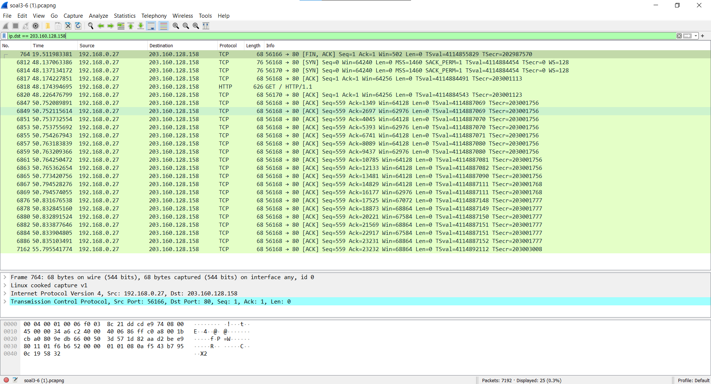
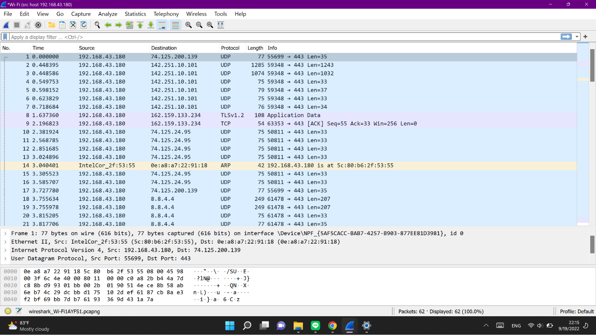
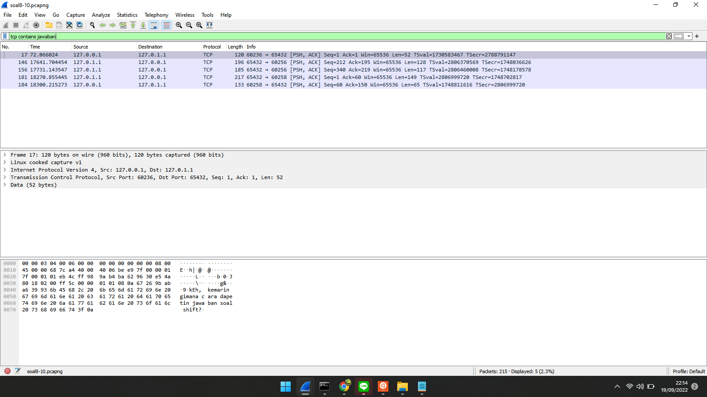
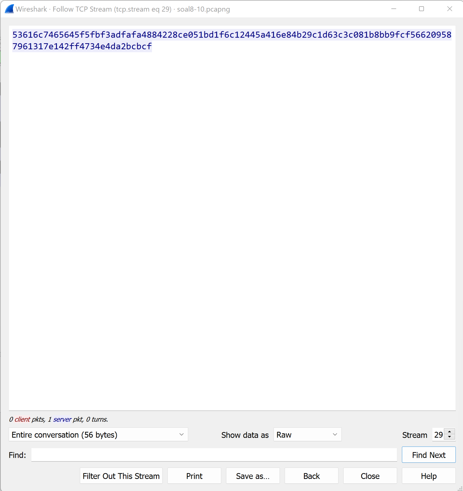
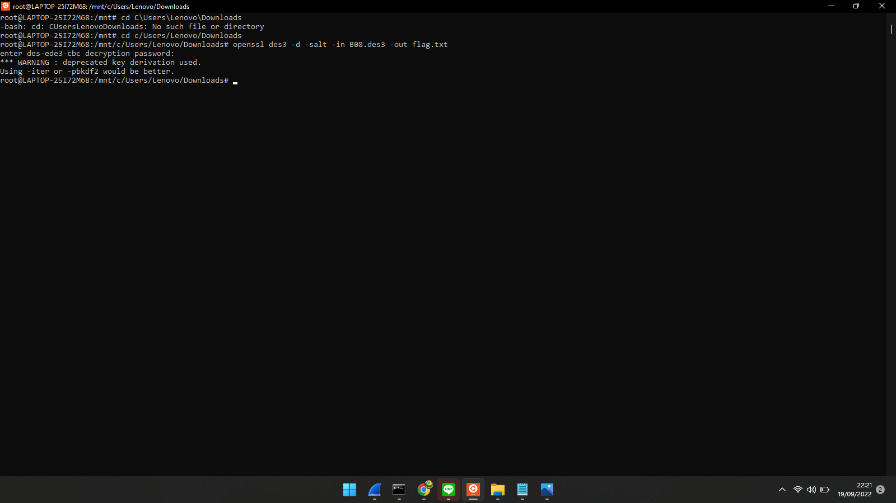

# Jarkom-Modul-1-B08-2022

## Anggota Kelompok
<table>
 	<tr>
 		<td> Nama </td>
 		<td> NRP</td>
 	</tr>
 	<tr>
 		<td> Aaliyah Farah Adibah </td>
 		<td> 5025201070 </td>
 	</tr>
  <tr>
 		<td> Rafael Asi Kristanto Tambunan </td>
 		<td> 5025201168 </td>
 	</tr>
  <tr>
 		<td> Sejati Bakti Raga </td>
 		<td> 5025201007 </td>
 	</tr>
 </table>

## Daftar Isi
  + [Soal 1](#soal-1)
  + [Soal 2](#soal-2)
  + [Soal 3](#soal-3)
  + [Soal 4](#soal-4)
  + [Soal 5](#soal-5)
  + [Soal 6](#soal-6)
  + [Soal 7](#soal-7)
  + [Soal 8](#soal-8)
  + [Soal 9](#soal-9)
  + [Soal 10](#soal-10)
  + [Kendala](#kendala)
  
## Soal 1
***Sebutkan web server yang digunakan pada "monta.if.its.ac.id"!***  
Untuk mendapatkan web server yang digunakan pada "monta.if.its.ac.id", digunakan langkah-langkah sebagai berikut:
  1. Download resource soal1-2.pcapng dan buka filenya di wireshark
  2. Display filter dengan key “tcp”
  3. Pilih Analyze
  4. Pilih Follow
  5. Pilih TCP Stream
  6. Ubah Stream dan cek satu persatu dari 0 sampai menemukan Server yang digunakan. Disini jawaban yang didapatkan berada pada Stream 3
  
Server yang digunakan: **nginx/1.10.3**
 

## Soal 2
***Ishaq sedang bingung mencari topik ta untuk semester ini, lalu ia datang ke website monta dan menemukan detail topik pada website “monta.if.its.ac.id” , judul TA apa yang dibuka oleh ishaq?***  
Untuk mendapatkan detail topik yang dibuka pada website "monta.if.its.ac.id", digunakan langkah-langkah sebagai berikut:
  1. Download resource soal1-2.pcapng dan buka filenya di wireshark
  2. Display filter dengan kata kunci **http.request.uri contains “detail”**
  3. Copy link yang di highlight untuk ditambahkan pada website “monta.if.its.ac.id” sehingga menjadi http://monta.if.its.ac.id/index.php/topik/detailTopik/194
 
Judul TA: **Evaluasi unjuk kerja User Space Filesystem (FUSE)**

## Soal 3
***Filter sehingga wireshark hanya menampilkan paket yang menuju port 80!***  
Untuk mendapatkan display wireshark yang hanya menampilkan paket menuju port 80, digunakan langkah-langkah sebagai berikut:
  1. Download resource soal3-6.pcapng dan buka filenya di wireshark
  2. Display filter dengan menggunakan dstport karena menuju port 80 sehingga menjadi **tcp.dstport == 80 || udp.dstport == 80**
 
Filter: **tcp.dstport == 80 || udp.dstport == 80**

## Soal 4
***Filter sehingga wireshark hanya mengambil paket yang berasal dari port 21!***  
Untuk mendapatkan display wireshark yang hanya menampilkan paket berasal port 21, digunakan langkah-langkah sebagai berikut:
  1. Download resource soal3-6.pcapng dan buka filenya di wireshark
  2. Display filter dengan menggunakan srcport karena berasal port 21 sehingga menjadi **tcp.srcport == 21 || udp.srcport == 21**
  
 Filter: **tcp.srcport == 21 || udp.srcport == 21**
 
 

## Soal 5
***Filter sehingga wireshark hanya mengambil paket yang berasal dari port 443!***  

Untuk mendapatkan display wireshark yang hanya menampilkan paket berasal port 443, digunakan langkah-langkah sebagai berikut:
  1. Download resource soal3-6.pcapng dan buka filenya di wireshark
  2. Display filter dengan menggunakan dstport dan srcport karena berasal port 443 sehingga menjadi → tcp.srcport == 443 || udp.srcport == 443

 Filter: **tcp.srcport == 443 || udp.srcport == 443**
 
 

## Soal 6
***Filter sehingga wireshark hanya menampilkan paket yang menuju ke lipi.go.id!***  

Untuk mendapatkan display wireshark yang hanya menampilkan paket menuju port 80, digunakan langkah-langkah sebagai berikut:
  1. Download resource soal3-6.pcapng dan buka filenya di wireshark
  2. Cari ip address dari lipi.go.id yang akan digunakan untuk memfilter nantinya
  
 

  3. Display filter dengan menggunakan ip dst karena menuju ke lipi.go.id  sehingga menjadi → ip.dst == 203.160.128.158

Filter: **ip.dst == 203.160.128.158**

## Soal 7
***Filter sehingga wireshark hanya mengambil paket yang berasal dari ip kalian!***  

Untuk mendapatkan display wireshark yang hanya menampilkan paket yang berasal dari ip kalian, digunakan langkah-langkah sebagai berikut:
  1. Buka Wireshark
  2. Lalu masukkan ip pada bagian Capture filter bagian bawah yang diambil dari setting laptop yang akan dimasukkan untuk memfilter nantinya 

 IP address: **192.168.43.180** 
 Capture Filter : **src host 192.168.43.180**
 
 

## Soal 8
***Telusuri aliran paket dalam file .pcap yang diberikan, cari informasi berguna berupa percakapan antara dua mahasiswa terkait tindakan kecurangan pada kegiatan praktikum. Percakapan tersebut dilaporkan menggunakan protokol jaringan dengan tingkat keandalan yang tinggi dalam pertukaran datanya sehingga kalian perlu menerapkan filter dengan protokol yang tersebut.***  

Untuk menulusuri percakapan pada file yang telah disiapkan
  1. Melakukan filter menggunakan kata yang kemungkinan terdapat dalam percakan tersebut, contohnya soal, jawaban, dan lain-lain.
  2. Masukan command tcp contains jawaban pada wireshark.
  3. Kemudian follow address yang telah didapatkan untuk melihat isi percakapan tersebut.

## Soal 9
***Terdapat laporan adanya pertukaran file yang dilakukan oleh kedua mahasiswa dalam percakapan yang diperoleh, carilah file yang dimaksud! Untuk memudahkan laporan kepada atasan, beri nama file yang ditemukan dengan format [nama_kelompok].des3 dan simpan output file dengan nama “flag.txt”.***  

Setelah melihat isi percakapan terdapat petunjuk bahwa file dikirim melalui port 9002
  1. Masukan command tcp.srcport==9002.
  2. Pilih analyze.
  3. Pilih follow.
  4. pilih tcp stream.
  5. Ubah format filenya menjadi raw kemudian save dengan penamaan sesua nama kelompok yaitu B08.des3
  6. Selanjutnya untuk mendekripsi file des3 nya gunakan wsl.
  7. Masukan command openssl des3 -d -salt -in B08.des3 -out flag.txt.
  8. Penjelasan password pada nomer 10.

## Soal 10
***Temukan password rahasia (flag) dari organisasi bawah tanah yang disebutkan di atas!***  

Setelah mendekripsi file des3 nya pengguna akan dimintai password untuk membuka file falg.txt nya. 
  1. Pada percakapan yang didapatkan di nomer 8 ditemukan petunjuknya untuk passwordnya yaitu karakter anime kembar lima.
  2. Passwordnya adalah nakano yaitu marga atau nama keluarga dari karakter anime tersebut.
  3. Setelah memasukan password maka file flag.txt nya bisa dibuka dan berikut ini outputnya.

## Kendala
  + Aaliyah Farah Adibah
    1. Baru dalam menggunakan wireshark 
    2. Jadwal jarkom bentrok dengan suporteran basket putri FTEIC vs FTK pada hari senin kemarin
  + Rafael Asi Kristanto Tambunan
    1. Baru dalam menggunakan wireshark
    2. Saat menggunakan wireshark, pada halaman pertama tidak tersedia bagian localhost area
       

  + Sejati Bakti Raga
    1. Baru dalam menggunakan wireshark
    2. Referensi anime yang kurang untuk nomer 10
