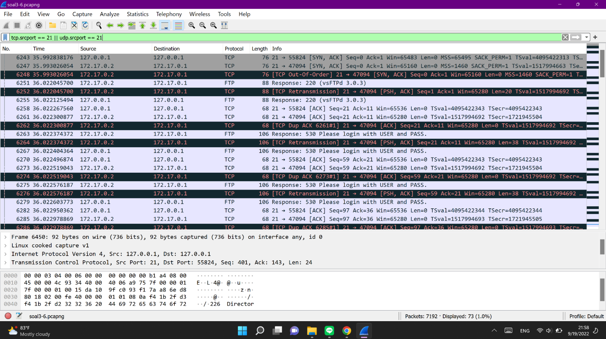

# Jarkom-Modul-1-B08-2022

## Daftar Isi
  + [Soal 1](#soal-1)
  + [Soal 2](#soal-2)
  + [Soal 3](#soal-3)
  + [Soal 4](#soal-4)
  + [Soal 5](#soal-5)
  + [Soal 6](#soal-6)
  + [Soal 7](#soal-7)
  + [Soal 8](#soal-8)
  + [Soal 9](#soal-9)
  + [Soal 10](#soal-10)
  + [Kendala](#kendala)
  
## Soal 1
***Sebutkan web server yang digunakan pada "monta.if.its.ac.id"!***  
Untuk mendapatkan web server yang digunakan pada "monta.if.its.ac.id", digunakan langkah-langkah sebagai berikut:
  1. Download resource soal1-2.pcapng dan buka filenya di wireshark
  2. Display filter dengan key “tcp”
  3. Pilih Analyze
  4. Pilih Follow
  5. Pilih TCP Stream
  6. Ubah Stream dan cek satu persatu dari 0 sampai menemukan Server yang digunakan. Disini jawaban yang didapatkan berada pada Stream 3
  
Server yang digunakan: **nginx/1.10.3**
 

## Soal 2
***Ishaq sedang bingung mencari topik ta untuk semester ini, lalu ia datang ke website monta dan menemukan detail topik pada website “monta.if.its.ac.id” , judul TA apa yang dibuka oleh ishaq?***  
Untuk mendapatkan detail topik yang dibuka pada website "monta.if.its.ac.id", digunakan langkah-langkah sebagai berikut:
  1. Download resource soal1-2.pcapng dan buka filenya di wireshark
  2. Display filter dengan kata kunci **http.request.uri contains “detail”**
  3. Copy link yang di highlight untuk ditambahkan pada website “monta.if.its.ac.id” sehingga menjadi http://monta.if.its.ac.id/index.php/topik/detailTopik/194
 
Judul TA: **Evaluasi unjuk kerja User Space Filesystem (FUSE)**

## Soal 3
***Filter sehingga wireshark hanya menampilkan paket yang menuju port 80!***  
Untuk mendapatkan display wireshark yang hanya menampilkan paket menuju port 80, digunakan langkah-langkah sebagai berikut:
  1. Download resource soal3-6.pcapng dan buka filenya di wireshark
  2. Display filter dengan menggunakan dstport karena menuju port 80 sehingga menjadi **tcp.dstport == 80 || udp.dstport == 80**
 
Filter: **tcp.dstport == 80 || udp.dstport == 80**

## Soal 4
***Filter sehingga wireshark hanya mengambil paket yang berasal dari port 21!***  
Untuk mendapatkan display wireshark yang hanya menampilkan paket berasal port 21, digunakan langkah-langkah sebagai berikut:
  1. Download resource soal3-6.pcapng dan buka filenya di wireshark
  2. Display filter dengan menggunakan srcport karena berasal port 21 sehingga menjadi **tcp.srcport == 21 || udp.srcport == 21**
  
 Filter: **tcp.srcport == 21 || udp.srcport == 21**
 
 

## Soal 5
***Filter sehingga wireshark hanya mengambil paket yang berasal dari port 443!***  

## Soal 6
***Filter sehingga wireshark hanya menampilkan paket yang menuju ke lipi.go.id!***  

## Soal 7
***Filter sehingga wireshark hanya mengambil paket yang berasal dari ip kalian!***  

## Soal 8
***Telusuri aliran paket dalam file .pcap yang diberikan, cari informasi berguna berupa percakapan antara dua mahasiswa terkait tindakan kecurangan pada kegiatan praktikum. Percakapan tersebut dilaporkan menggunakan protokol jaringan dengan tingkat keandalan yang tinggi dalam pertukaran datanya sehingga kalian perlu menerapkan filter dengan protokol yang tersebut.***  

## Soal 9
***Terdapat laporan adanya pertukaran file yang dilakukan oleh kedua mahasiswa dalam percakapan yang diperoleh, carilah file yang dimaksud! Untuk memudahkan laporan kepada atasan, beri nama file yang ditemukan dengan format [nama_kelompok].des3 dan simpan output file dengan nama “flag.txt”.***  

## Soal 10
***Temukan password rahasia (flag) dari organisasi bawah tanah yang disebutkan di atas!***  

## Kendala
  + Aaliyah Farah Adibah
    1. Baru dalam menggunakan wireshark 
    2. Jadwal jarkom bentrok dengan suporteran basket putri FTEIC vs FTK pada hari senin kemarin
  + Rafael Asi Kristanto Tambunan
  + Sejati Bakti Raga
